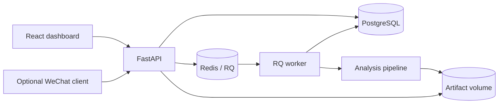

# StepWise

StepWise is a wearable-sensor analytics application for four-channel plantar-pressure and
foot-mounted IMU recordings. It accepts text recordings, runs an explainable signal-processing
pipeline in a background worker, and produces structured results, charts, and a non-diagnostic HTML
report. The project focuses on backend architecture and reproducible data processing rather than
clinical prediction.

> StepWise is an engineering prototype. It is not clinically validated and does not diagnose gait,
> neurological, or musculoskeletal conditions.

## Demo

The repository includes deterministic synthetic recordings, so the application can be demonstrated
without private sensor data.

```text
walking TXT + optional standing calibration
        -> parse and validate
        -> detect foot contact and stance intervals
        -> extract pressure and orientation features
        -> evaluate conservative screening rules
        -> JSON + CSV + PNG charts + HTML report
```

Example outputs are available in [`example_output/`](example_output/). The fixtures are software-test
data only and do not represent clinical gait distributions.

## Architecture



The API validates uploads, stores input artifacts, creates a `QUEUED` database record, and enqueues
the analysis ID. The worker changes the record to `RUNNING`, calls the same pipeline used by the CLI
and tests, stores generated artifacts, and records either `SUCCEEDED` or `FAILED`. The web client
polls the status endpoint while the job runs.

## Tech Stack

| Area | Technology |
|---|---|
| Analysis | Python, pandas, NumPy, Matplotlib |
| API | FastAPI, Pydantic |
| Persistence | SQLAlchemy 2, PostgreSQL, Alembic |
| Background jobs | Redis, RQ |
| Web client | React, TypeScript, Vite |
| Tooling | pytest, Ruff, mypy, ESLint, Docker Compose, GitHub Actions |

## Key Engineering Features

- **Asynchronous jobs:** analysis and report generation run outside the HTTP request, while
  PostgreSQL remains the source of truth for job state.
- **Testable pipeline:** parsing, calibration, contact detection, stance segmentation, feature
  extraction, data-quality checks, and rule evaluation are separate modules.
- **Persistent artifacts:** uploaded recordings and generated reports are referenced in the database
  and stored under path-checked per-analysis directories.
- **Defensive input handling:** the API limits upload size and content type, rejects malformed text,
  sanitizes non-finite JSON values, and returns safe public errors.
- **Reproducible examples:** a fixed-seed generator creates normal, noisy, short, malformed, and
  pressure-loading scenarios for tests and demos.

## Getting Started

### Full application

Docker with Compose is required.

```bash
git clone https://github.com/xiaorui7/StepWise-Wearable-Sensor-Analytics-Platform.git
cd StepWise-Wearable-Sensor-Analytics-Platform
docker compose up --build -d
```

Then open:

- Dashboard: `http://localhost:5173`
- OpenAPI documentation: `http://localhost:8000/docs`
- Health endpoint: `http://localhost:8000/health`

Click **Load demo data** to submit the bundled synthetic walking and standing files.

Useful lifecycle commands:

```bash
docker compose ps          # inspect service health
docker compose logs -f     # follow application logs
docker compose down        # stop the stack without deleting persistent volumes
```

Do not add `-v` to `docker compose down` unless you intentionally want to delete the database and
generated artifacts.

### Analysis CLI

The pipeline can also run without PostgreSQL or Redis:

```bash
python -m venv .venv
# Windows: .venv\Scripts\activate
# macOS/Linux: source .venv/bin/activate
pip install -e ".[dev]"

stepwise-analyze fixtures/synthetic/normal_like.synthetic.txt \
  --standing-file fixtures/synthetic/standing_neutral.synthetic.txt \
  --output-dir local-output
```

## API

| Method | Path | Purpose |
|---|---|---|
| `POST` | `/api/v1/analyses` | Upload a walking file and optional calibration file |
| `GET` | `/api/v1/analyses/{id}` | Read persisted job status |
| `GET` | `/api/v1/analyses/{id}/result` | Read a completed structured result |
| `GET` | `/api/v1/analyses` | List recent analyses |
| `GET` | `/api/v1/analyses/{id}/artifacts/{name}` | Retrieve a generated artifact |
| `GET` | `/health` | Process liveness |
| `GET` | `/ready` | Database and Redis readiness |

`POST /api/v1/analyses/text` is retained for the optional WeChat client.

## Tests

```bash
pytest --cov=stepwise --cov-branch --cov-report=term
ruff check src tests scripts
mypy src/stepwise

cd web
pnpm install --frozen-lockfile
pnpm lint
pnpm build
```

The suite covers parser failures, sensor mapping, hysteresis contact detection, known stance
intervals, feature direction, screening-rule conflicts, data-quality warnings, JSON sanitation,
artifact path safety, database state, queue failures, and an upload-to-report workflow.

The PostgreSQL-specific test requires `STEPWISE_TEST_POSTGRES_URL`. Other tests use temporary SQLite
databases so they can run without external services.

The latest local verification completed 29 tests with 86% branch coverage; one PostgreSQL-specific
test was skipped in that test run. Ruff, strict mypy, frontend lint, and the Vite production build
passed. The complete five-service Docker Compose stack was subsequently built and exercised with
PostgreSQL and Redis: health/readiness checks passed, a synthetic asynchronous analysis completed,
all expected artifacts were retrieved, and the persisted result remained available after restarting
the API container. See [`docs/DOCKER_VERIFICATION.md`](docs/DOCKER_VERIFICATION.md) for the exact
commands and observed results.

The checked-in sequential benchmark runs the complete pipeline, including parsing, analysis, charts,
and report generation. Its latest 20-run result is recorded in
[`benchmark-results/latest.md`](benchmark-results/latest.md). It is a local synthetic-data benchmark,
not a concurrency or production-load claim.

## Project Structure

```text
src/stepwise/core/       signal processing and screening rules
src/stepwise/api/        FastAPI routes and request/response schemas
src/stepwise/pipeline.py analysis orchestration and artifact generation
src/stepwise/jobs.py     RQ enqueueing and worker execution
src/stepwise/repository.py database state transitions
src/stepwise/storage.py  filesystem artifact storage
web/                     React dashboard
miniprogram/             optional WeChat client
tests/                   core, integration, and end-to-end tests
fixtures/synthetic/      deterministic software-test recordings
scripts/                 fixture generation and benchmark tooling
```

## Design Decisions

- **Modular monolith over microservices:** the workload does not justify independent services, but
  the API and worker run as separate processes from one package.
- **RQ over a streaming platform:** jobs need enqueueing and failure handling, not replay, partitions,
  or multiple event consumers.
- **PostgreSQL owns job state:** Redis transports work; it is not the source of truth for user-visible
  status or results.
- **Synthetic public data:** real recordings are excluded for privacy. Synthetic fixtures verify
  software behavior but cannot establish medical accuracy.

More context is recorded in [`docs/adr/`](docs/adr/) and the engineering thresholds are documented in
[`docs/StepWise_decision_rules_EN.md`](docs/StepWise_decision_rules_EN.md).

## Future Improvements

- Add explicit RQ retry and idempotency behavior for interrupted jobs.
- Benchmark concurrent API-to-worker workloads in addition to the sequential pipeline benchmark.
- Add authentication and per-user data isolation before any multi-user deployment.
- Implement object storage only if deployment requirements outgrow the shared filesystem volume.

## License

This project is available under the [MIT License](LICENSE).
